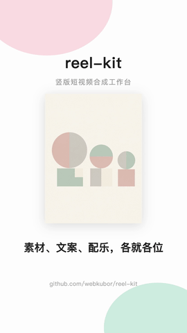
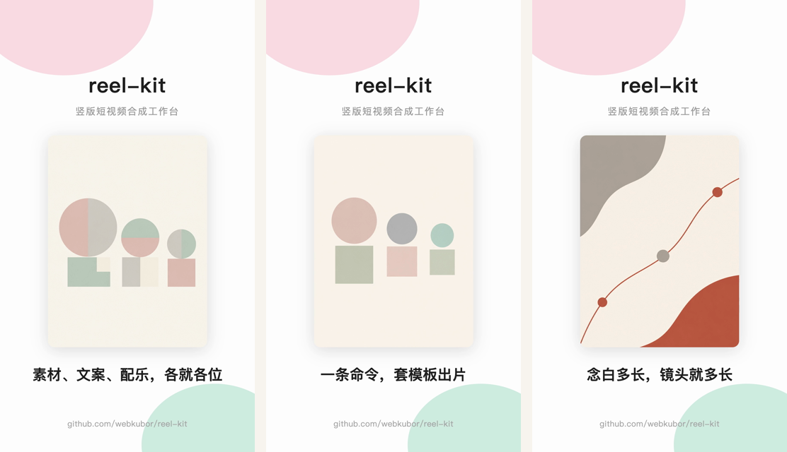

<p align="center">
  <picture>
    <source media="(prefers-color-scheme: dark)" srcset="docs/logo-light.svg" />
    
  </picture>
</p>

<p align="center">
  <a href="https://www.npmjs.com/package/@kubor/reel-kit"></a>
  
  
  = 18" />
  
  
</p>

<p align="center">
  <b>Vertical short-form video production studio — UI + CLI dual form</b>
  <br />
  Assets + per-line captions + voice-over/BGM, drop into a template, get the mp4. Layout in <b>HTML/CSS</b>, shot duration driven by <b>voice</b>, voice runs through <b>local TTS</b> at zero cost.
  <br />
  <sub>Covers three things: <b>promo / editing / video-prompt template authoring</b> — one repo, both scriptable CLI and visual Studio</sub>
</p>

[中文](./README.md) · [Quick start](#-30-second-quick-start) · [Comparison](#-vs-other-approaches) · [Voice](#-voice) · [Repo structure](#-repo-structure-merged-2026-09)

<p align="center">
  
</p>

<p align="center">
  <sub>The above is generated by reel-kit itself — assets, voice-over, compositing all local;
  <a href="examples/">examples/</a> contains the full reproducible input</sub>
</p>

<p align="center">
  
</p>

---

## Thumbnail / storyboard-frame understanding (mlx-vlm-kit)

This tool has no image-recognition model built in. For thumbnail QA, storyboard-frame content understanding, copy matching, use the local-shared [mlx-vlm-kit](https://github.com/webkubor/mlx-vlm-kit) (free / offline):

```bash
vlm describe ./ep07-thumb.jpg                       # thumbnail content
vlm ask frame01.png --q "does this frame match script line 3"   # script alignment check
```

In an agent workflow, you can also call via museav-mcp.

---

## ⚡ 30-second quick start

```bash
# CLI: one-liner to render
reel make --template sticker-promo --title "New feature" \
  --assets ./shots --caps ./captions.txt --out out.mp4

# UI: Studio workbench (local HTTP, 127.0.0.1:5273)
pnpm dev --filter @kubor/reel-studio
```

```bash
npm i -g @kubor/reel-kit          # or npx @kubor/reel-kit ...

reel make --template sticker-promo \
  --title "reel-kit" --subtitle "Vertical short-form video studio" \
  --assets ./examples/assets --caps ./examples/demo-caps.txt \
  --voice demo_narrator --bgm ./bgm.mp3 \
  --out demo.mp4
```

The repo ships full assets and captions — this command reproduces the demo above.

## 🎯 What problem it solves

When making emoji-sticker promos, product short videos, you end up improvising an ffmpeg incantation every time. **The output stays, the workflow doesn't** — the directory only has the mp4, assets, and captions; the compositing logic gets thrown away, so next time you have to re-derive it from scratch.

reel-kit turns that workflow into a reusable command.

## ⚖️ vs other approaches

| | JianYing / CapCut | Raw FFmpeg | MoviePy | Remotion | **reel-kit** |
|---|:---:|:---:|:---:|:---:|:---:|
| Batch | ❌ manual | ✅ | ✅ | ✅ | ✅ |
| Cost of changing layout | drag the timeline | **write drawtext filter chain** | write Python | write React | **write CSS** |
| Chinese typography | ✅ | ⚠️ hand-typed font path/stroke/wrap | ⚠️ font metrics traps | ✅ | ✅ browser layout |
| Voice-over | manual import | DIY | DIY | DIY | ✅ built-in, **local TTS, zero cost** |
| Shot duration | manual drag | fixed | fixed | programmable | ✅ **shot length follows voice length** |
| Runtime deps | client app | ffmpeg | Python + moviepy | Node + React + Chromium | Node + ffmpeg + **local Chrome** |
| Scope | general editing | general | general | general | **templated vertical short-form** |

**reel-kit is not a general-purpose editor** — it only does "one image per shot + per-line captions" style templated shorts. Color grading, multi-track, frame-accurate alignment — that's DaVinci Resolve territory, a different problem.

### Three concrete differences

**① Adding a template = drop in an HTML, no code changes**

Layout is `templates/*.html`, placeholders `{{title}}` `{{caption}}` `{{image}}`. To change font size, add curved decoration, swap palette — edit a few lines of CSS, see the result directly in the browser.

Doing the same with ffmpeg's `drawtext`: hand-write Chinese font paths, stroke, wrap, centering; curved decoration isn't even drawable — and each change means re-tuning a filter chain without seeing the effect.

**② Shot length = voice length**

```
Fixed 2.5s/shot  →  20.0s   fast lines stall, slow lines get cut off
Voice-driven      →  16.7s   shots 1.7~2.7s, natural pacing
```

**③ Voice via local TTS, batch at zero cost**

Defaults to [voxcraft](https://github.com/webkubor/voxcraft) (local Qwen3-TTS) — one-time 4.2 GB model download, then every sentence is free, with voice cloning for IP-specific timbre. Alternatively `--voice-engine museav` for API mode (no local model needed, billed by token).

---

## 📦 Repo structure (after 2026-09 three-way merge)

```
reel-kit/                          # @kubor/reel-kit (unified single repo)
├── bin/                           # CLI entry (the `reel` command)
├── src/                           # video compositing core (also exported as a lib: import { renderFrames, compose, ... })
├── templates/                     # 5 HTML templates (sticker-promo/square/quote/landscape/music-card)
├── studio/                        # @kubor/reel-studio — Vue 3 + Vite 8 visual workbench
│   ├── src/views/                 #   11 views: shot board / character library / episodes / prompt lab / batch / promo slots …
│   └── server/                    #   built-in Node backend (mounted as Vite middleware, 127.0.0.1 only)
├── prompts/                       # prompt template library
│   ├── agents/                    #   authoring specs (CREATIVE_BIBLE etc.)
│   └── handdrawn/                 #   20 hand-drawn style recipes (inherited from story-to-handdrawn-video)
├── seasons/                       # multi-season / multi-IP production data
│   └── s1/novels/.agent-skills/   #   7 production-period Skill configs (writer-hub / namer-hub / worldbook-audit …)
├── docs/                          # design trade-offs, compositing notes
└── examples/                      # fully reproducible demo assets
```

How the three things map:

- **Promo** = `studio/` `EpisodesView` / `GalleryView` + `prompts/agents` authoring specs
- **Editing** = `bin/reel.mjs` CLI + `src/` compositing engine (exported as a lib)
- **Video-prompt template authoring** = `prompts/handdrawn/` style library + `studio/` `PromptLabView` / `AestheticView` + `seasons/s1/novels/.agent-skills/` Skill library

UI and CLI share `src/`: Studio imports core modules directly via `studio/server/lib/...` (same-repo relative paths, no monorepo tooling, no npm link).

```bash
npm i -g @kubor/reel-kit
```

Or run without installing:

```bash
npx @kubor/reel-kit make --template sticker-promo ...
```

To edit templates or run the demo, clone the source (the `examples/` only lives in the repo, not in the npm package):

```bash
git clone https://github.com/webkubor/reel-kit
cd reel-kit && pnpm install
npm link
```

Dependencies: **ffmpeg** (compositing), **local Chrome** (renders layout — does NOT download extra chromium; override path via `CHROME_PATH`).

Voice-over is optional — without `--voice` you don't need any TTS.

## 🎙️ Voice

```bash
reel make ... --voice <timbre>                 # voxcraft local (default)
reel make ... --voice <timbre> --voice-engine museav   # API backend
```

| | voxcraft (default) | museav |
|---|---|---|
| Where | local Qwen3-TTS Base-1.7B | Xiaomi MiMo API |
| Cost | one-time 4.2 GB model, then free | billed by token |
| Timbres | voice cloning / text-described timbres | preset timbres, ready out of the box |
| Prerequisite | must register a timbre first | none |

> voxcraft's timbre library is empty by default. Until you register a timbre, `--voice` will fail; use `--voice-engine museav` as fallback.
> reel-kit auto-locates voxcraft on your machine (its `voice` command lives in a venv, not on PATH by default). When something is missing, it reports clearly and gives a copy-pasteable fix command — **it will never silently download a 4.2 GB model**.

### How audio/video alignment is guaranteed

After each voice-over, pad silence to `(shot duration − voice duration)` via `apad=whole_dur=<shot duration>`, then concat head-to-tail. **No offset arithmetic, so no accumulated drift.**

Measured across 8 shots: shot head -13 to -19 dB (voice), shot tail -91 dB (padded silence), still exact at shot 8.

When BGM is added, it's auto-attenuated to 0.22 gain as a bed (adjustable via `--bgm-gain`). Measured: voice segments -17 to -21 dB, gaps pure BGM -25 to -33 dB, 6–13 dB gap — voice up front, BGM doesn't compete.

---

## 🎵 BGM library (optional)

Easiest usage is to point at a file directly:

```bash
reel make ... --bgm ./local.mp3
```

If you have a batch of regular BGM, build a manifest and look them up by **alias** without re-pathing every time:

```bash
export REEL_BGM_MANIFEST=https://your-domain/music-manifest.json
# or write to ~/.reel-kit/config.json: { "bgmManifest": "..." }

reel bgm                        # list available tracks (alias / duration / mood / license)
reel make ... --bgm upbeat      # fetch by alias, auto-download on first use, cache to ~/.reel-kit/bgm/
```

Manifest format (`REEL_BGM_MANIFEST` can be a URL or a local json path):

```json
{
  "cdn": "https://your-domain/",
  "bgm": [
    {
      "alias": "upbeat",
      "key": "bgm/upbeat.mp3",
      "duration": 113,
      "mood": ["upbeat", "daily"],
      "license": "CC0 / attribution-free commercial OK",
      "source": "where the track came from"
    }
  ]
}
```

`key` can be a path relative to `cdn`, a full URL, or a local absolute path.

> **reel-kit ships no music** — licensing is the user's responsibility; bundling a batch would only cause you trouble.

### When `license` is filled in, it prints at render time

```
[reel] BGM "upbeat" license: CC0 / attribution-free commercial OK
```

**Every** render, not just the first download. This isn't decoration: videos ship externally, "can this be used commercially, does it need attribution" must be visible *at* the render moment — once shipped, you don't have time to dig through records, and humans specifically forget licensing across many renders. So fill in every entry of your manifest.

Remote manifests cache for a day, falling back to the cached version when offline; a failed fetch won't fail the render. Local manifests don't cache — edit, take effect immediately.

---

## ⚙️ Common parameters

```
--template <name>      Template, default sticker-promo (`reel templates` for all)
--assets <dir|file>    Asset images, directory sorted by filename
--caps <file>           Per-line captions, one per line, line count = shot count
--title/--subtitle/--footer   Template text
--bgm <alias|file>     Background music, auto-loop to fill + fade out at end. Aliases from `reel bgm`
--bgm-gain <0~1>       BGM gain, defaults to 0.22 when voice-over is on
--voice <timbre>       Enable voice-over, shot duration driven by voice length
--voice-margin <sec>   Buffer after voice per shot, default 0.45
--per-shot <sec>       Fixed shot length without voice, default 2.5
--size <WxH>           Canvas, default 1080x1920
--keep-frames          Keep intermediate frames, useful for tweaking layout
```

## 🧩 Design trade-offs

**Why use a browser for layout rendering** — see "Three concrete differences" ① above. The cost is one screenshot per frame, but a piece has only 8–20 frames, just seconds. As a bonus, this dodges the entire class of MoviePy-ecosystem issues with font metrics, visual centering, and handle leaks (see [`docs/video-compositing-notes.md`](docs/video-compositing-notes.md)).

**Why concat demuxer instead of `-framerate 1/2.5`** — the latter requires every shot to have equal length, but "let the last shot linger a moment" is a natural requirement.

> ⚠️ ffmpeg's concat list **must not** duplicate the last frame: doing so on ffmpeg 7.x causes it to emit one extra shot's worth of duration (5 shots × 2.5 s should be 12.5 s, with duplication measured 15.0 s; without duplication measured 12.43 s, within 0.1 s of the frame-rounding error). Don't add `which time` from older docs — see `AGENTS.md` rule 1.

**When asset count and caption count differ**, take the smaller side and **explicitly report which weren't used** — silent truncation makes you think the piece is complete when it isn't.

**voxcraft runs in web-server mode** — its CLI reloads the 4.2 GB model on every call, which means 8 sentences = 8 model loads, slow and unstable (measured crash at sentence 5 with `libc++ recursive_mutex`). Now: start one server, make multiple calls, tear down after use. Already-running servers get reused.

## 🖼 Asset requirements

Templates display assets as **subject images** centered. For sticker effect, assets must be **pre-cutout** (transparent PNG). This tool does not do cutout — that's an upstream concern; doing it here would just be a second implementation.

## ⚠️ Known limitations

- **No transitions**: hard cuts between shots. Adding transitions means a new `xfade` filter chain in `compose.mjs`.
- **One line, one shot**: long lines wrap naturally in the template, but don't split into two shots.
- **Only one template shape**: `sticker-promo` (1080×1920 vertical). Landscape multi-shot templates not done yet.
- **BGM shorter than the video loops**: filled with `aloop` and faded out; if the seam is obvious, use a longer track.

## 🌐 GitHub Pages site

`docs/index.html` is the official single-page site for reel-kit; once deployed to GitHub Pages it's accessible at `https://webkubor.github.io/reel-kit/`.

**Enable in 30 seconds:**

1. GitHub repo → **Settings** → **Pages**
2. **Source** pick `Deploy from a branch`
3. **Branch** `main` · **Folder** `/docs`
4. Save, a few minutes later it goes live

`docs/` contains:

- `index.html` — single-page site (hero / features / 5 template previews / 30-second start)
- `style.css` — primary Reel red (`#cc584d`) brand styling
- `logo.svg` / `logo-light.svg` — light / dark mode logo
- `analytics-setup.md` — analytics integration guide (off by default, opt-in)

## 📄 License

MIT